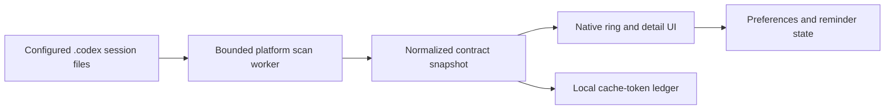

# Design

Codex Usage Widget presents the same local-session-observation contract through native Windows and macOS interfaces. The platforms share fixtures and behavior, not a runtime or UI framework.

## Components

| Concern | Windows | macOS |
|---|---|---|
| Parser, window selection, token aggregation | `CodexUsageWidget.ps1` | `Core/UsageCore.swift` |
| Isolated scan entry point | `-ScanWorker` | `--scan-worker` |
| UI | WPF and Windows Forms tray integration | AppKit panels with SwiftUI content |
| State directory | `%LOCALAPPDATA%\CodexUsageWidget` | `~/Library/Application Support/CodexUsageWidget` |
| Contract tests | `fixtures/contract/v1/` | The same fixtures and expected state |

The main process starts a short-lived worker for untrusted session input. The worker reads only the resolved data directory, performs bounded scans, and returns one normalized JSON response with a 256 KiB envelope. It does not write widget state. The main process validates the response before rendering it and is the only process that writes `preferences.json`, `cache-token-ledger.json`, and `reminders.json`.

## Shared contract

`fixtures/contract/v1/schema.md` defines the supported event shapes and normalized state. The contract covers malformed records, unsupported inputs, reset boundaries, cache ordering, precision, and tightest-window selection. A parser change is complete only when both platform implementations pass the same expected-state fixtures.

The percentage ring uses the valid primary quota window with the least remaining capacity. Same-cycle observations merge by highest used percentage; observations from older cycles do not replace newer state. Cache totals accumulate only newly observed per-session increases.

## UI parity

Both platforms keep the normal state to a percentage ring, show details after a 180 ms hover delay, support dragging and screen-edge snapping, expose the same eight theme identities and five locale packs, and use the same fictional demo fixture. Platform-native menus, notifications, focus behavior, and screen APIs are used where their conventions differ.

## Trust and privacy boundaries

- Data discovery is saved path, `CODEX_HOME`, home `.codex`, then a user picker.
- Session files and the optional task-name index are read only.
- No component calls a Web API, uploads telemetry, or stores Codex credentials.
- A user-selected network filesystem is still ordinary operating-system file access.
- Demo mode bypasses real data discovery and all persistent widget-state writes.
- Language packs and worker responses are size-limited and validated before use.

## Build and release

Windows uses the platform PowerShell/WPF stack and a small .NET Framework bootstrap. macOS uses the platform Swift/AppKit/SwiftUI stack. CI builds a Windows EXE/ZIP and an unsigned Universal macOS app containing both `arm64` and `x86_64`. Public macOS distribution adds Developer ID signing, Apple notarization, and Gatekeeper verification without changing application behavior.
