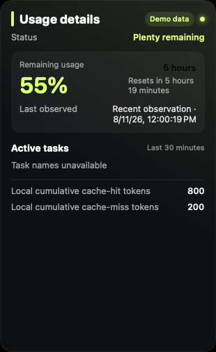

# Codex 用量小组件

适用于 Windows 和 macOS 的桌面用量圆环，可自由拖拽，悬停即可查看本机 Codex 用量。

[下载 v1.1.0](https://github.com/libaie/codex-usage-widget/releases/tag/v1.1.0) · [English](README.md) · [MIT 许可证](LICENSE)

Codex 用量小组件读取本机 Codex 会话文件，以紧凑的圆环展示剩余用量、令牌、缓存、上下文占用和近期活动任务。这是独立个人项目，不是 OpenAI 或 Codex 官方项目。界面内容来自本机会话观测，不是官方账单或账户数据。

## 产品截图

### Windows

  
  &nbsp;&nbsp;&nbsp;
  

### macOS

  
  &nbsp;&nbsp;&nbsp;
  

截图使用虚构演示数据。

## 功能

- 圆环始终置顶，可拖到任意位置，靠近屏幕边缘时自动吸附。
- 悬停查看当前限制、重置时间、令牌、上下文占用和最近 30 分钟更新的任务。
- 展示单任务及本机累计的缓存命中、缓存未命中令牌。
- 提供八种配色和五种界面语言：简体中文（`zh-CN`）、繁体中文（`zh-TW`）、英语（`en-US`）、日语（`ja-JP`）和韩语（`ko-KR`）。
- 只读取本机数据，不调用 Web API，不保存账号凭据，不上传文件，也不发送遥测数据。

## 下载与安装

安装包位于 [v1.1.0 发布页](https://github.com/libaie/codex-usage-widget/releases/tag/v1.1.0)。目前的 Windows 和 macOS 文件均未签名，打开前请先核对随附的 SHA-256 文件。

### Windows

系统需要 Windows PowerShell 5.1 和 WPF。

1. 下载 `CodexUsageWidget-v1.1.0-windows.exe` 及其 `.sha256` 文件。
2. 核对校验值后运行 EXE。

如需便携版，可下载 `CodexUsageWidget-v1.1.0-windows.zip`，解压后双击 `Start-CodexUsageWidget.vbs`。通过 VBS 启动不会遗留终端窗口。

### macOS

系统需要 macOS 13 或更高版本。Universal 构建同时支持 Apple 芯片和 Intel Mac。

1. 下载 `CodexUsageWidget-v1.1.0-macos-unsigned.zip` 及其 `.sha256` 文件。
2. 核对校验值，解压 ZIP，再将 `CodexUsageWidget.app` 移入“应用程序”。
3. 首次启动时，在访达中按住 Control 键点按应用并选择“打开”。如果系统仍然拦截，请前往“系统设置 → 隐私与安全性 → 仍要打开”。

小组件通常会自动找到当前用户的 Codex 数据。如果没有找到包含 `sessions` 的 `.codex` 文件夹，程序会提示你手动选择。

## 使用方法

| 操作 | 效果 |
|---|---|
| 拖动圆环 | 移动小组件；靠近屏幕边缘释放时自动吸附。 |
| 悬停圆环 | 打开用量详情。 |
| 悬停或聚焦任务 | 查看该任务的令牌、缓存和上下文数据。 |
| 右键圆环 | 修改语言、主题、数据文件夹或提醒设置，也可退出程序。 |
| 按回车或空格 | 圆环获得键盘焦点时，打开或关闭详情。 |
| 按 Esc | 关闭详情。 |

位置、主题、语言和所选数据文件夹会在下次启动时恢复。

## 隐私

小组件只读取选定的 Codex 数据文件夹，不扫描整个磁盘，不调用 Web API，不上传会话文件，也不发送遥测数据。圆环位置、主题、语言、所选文件夹、累计缓存令牌和提醒记录保存在操作系统的应用数据目录中。

## 开源

项目采用 [MIT 许可证](LICENSE)。源码构建方法见[参与开发](CONTRIBUTING.md)，安全问题请参阅[安全说明](SECURITY.md)，版本变化记录在[更新日志](CHANGELOG.md)中。

## 免责声明

Codex 会话格式可能发生变化。界面中的限制、重置时间、任务活动和令牌统计来自本地文件的尽力观测，不是 OpenAI 官方用量、账单或权益数据。
