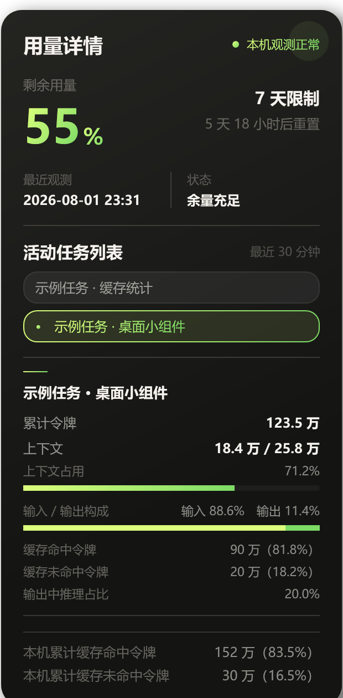

<div align="center">

# Codex 用量小组件

一个可拖拽的 Windows 桌面悬浮圆环，平时显示本机观测到的 Codex 用量，悬停后查看详情。

[Latest release / 最新版本](https://github.com/libaie/codex-usage-widget/releases/latest) · [MIT license / MIT 许可证](LICENSE) · [English](README.md) · **简体中文**

</div>

> [!IMPORTANT]
> 这是独立个人项目，不是 OpenAI 或 Codex 官方项目，与 OpenAI 无隶属关系，也未获得其背书。小组件面向本机 Codex 会话设计，读取已配置的文件系统路径；程序不调用 Web API，不上传或同步数据，也不保存账号凭据。显示数值默认来自本机会话观测；手动配置路径后，则以该路径中的会话为准。它们不是官方账单或账户数据。

## 产品简介

Codex 用量小组件把本机记录到的 Codex 活动转换为桌面百分比圆环。鼠标悬浮后可查看当前语言的详情，平时只显示圆环。

## 快速启动

1. 从[最新版本](https://github.com/libaie/codex-usage-widget/releases/latest)下载 `CodexUsageWidget-v1.0.0.zip` 并解压。
2. 双击 `Start-CodexUsageWidget.vbs`。
3. 本机会话数据可用后，等待约 15 秒，圆环便会刷新。

VBS 启动器不会显示终端窗口；`Start-CodexUsageWidget.cmd` 作为兼容入口保留。同一 Windows 登录会话只运行一个小组件实例。主脚本已启动但初始化失败时，会弹出错误消息框，依次说明问题、可能原因和处理办法；语言包故障使用内置中英双语提示。

如果常用 Codex 目录均无法找到，小组件会请你选择包含 `sessions` 的 `.codex` 目录。取消选择后不会反复弹窗，后续刷新仍会继续检测默认位置。

## 语言说明

界面提供简体中文（`zh-CN`）、繁体中文（`zh-TW`）、英语（`en-US`）、日语（`ja-JP`）和韩语（`ko-KR`）。首次启动按 Windows 界面语言自动选择。右键圆环并选择“语言”即可立即切换，选择结果会保存到下次启动；系统语言不受支持或可选语言包缺失时回退到英语。

## 产品截图

<p align="center">
  
  &nbsp;&nbsp;&nbsp;
  
</p>

<p align="center"><sub>截图由正式界面使用完全虚构、已脱敏的本机演示数据渲染。</sub></p>

## 核心特性

- 只显示百分比的圆环，始终悬浮在普通窗口上方。
- 可自由拖拽，靠近当前屏幕边缘时自动吸附。
- 提供简体中文、繁体中文、英语、日语和韩语五种界面语言。
- 八种同步主题：冰川青、星云紫、深海蓝、樱雾粉、极光绿、云母银、日落橙和青柠光。
- 鼠标悬浮显示当前语言的详情卡，包括最紧限制、重置倒计时、近期活动任务、累计令牌、上下文占用、输入输出构成和推理占比。
- 展示单任务缓存命中与未命中令牌，并单独维护不会因任务切换而回落的本机累计缓存账本。
- 最近 30 分钟更新的任务以轻胶囊形式展示；悬停或聚焦任务后查看该任务自己的详细数据。
- 支持托盘操作、键盘访问、低用量提醒、单实例保护和内置自检。
- 面向本机会话文件设计；读取已配置的文件系统路径，不调用 Web API，不上传或同步数据，也不保存账号凭据。

## 环境要求

- 带有 Windows PowerShell 5.1 和 WPF 组件的 Windows 系统。
- 本机已安装并至少运行过一次 Codex 任务，从而生成 `.codex\sessions` 目录。
- 不需要安装额外运行时或第三方依赖。

## 目录内容

```text
CodexUsageWidget/
├── CodexUsageWidget.ps1
├── Start-CodexUsageWidget.vbs
├── Start-CodexUsageWidget.cmd
├── README.md
├── README.zh-CN.md
├── locales/
│   ├── zh-CN.json
│   ├── zh-TW.json
│   ├── en-US.json
│   ├── ja-JP.json
│   └── ko-KR.json
├── assets/screenshots/
└── fixtures/
    ├── rate-limits.jsonl
    └── Test-Launcher.ps1
```

`CodexUsageWidget.ps1` 包含界面、本机数据解析、缓存账本、交互和自检；VBS 文件是推荐启动入口，命令文件作为兼容包装保留；`fixtures` 中的文件仅供自检使用。

## 操作方式

| 操作 | 效果 |
|---|---|
| 按住圆环左键拖动 | 移动小组件；靠近屏幕边缘释放时自动吸附。 |
| 鼠标悬浮约 250 毫秒 | 打开用量详情卡。 |
| 悬停或聚焦活动任务 | 展示该任务的令牌、缓存和上下文数据。 |
| 右键圆环 | 打开语言、主题与退出菜单。 |
| 圆环获得焦点后按回车或空格 | 打开或关闭详情卡。 |
| Esc | 关闭详情卡。 |
| Shift+F10 | 通过键盘打开同一右键菜单。 |
| 托盘菜单 | 显示或退出小组件。 |

位置和主题也会自动保存，并在下次启动时恢复。详情卡强调色与圆环主题同步；剩余用量到达 20% 和 10% 时，两处会分别切换为警告色和紧急色。

## 数据目录自动定位

小组件按以下顺序定位 Codex 数据目录：

1. 当前用户曾经手动选择的目录。
2. `CODEX_HOME` 环境变量。
3. `%USERPROFILE%\.codex`。
4. 以上位置均没有 `sessions` 时，由用户手动选择。

| 用途 | 位置 |
|---|---|
| Codex 会话事件 | 自动定位到的 `.codex\sessions`，只读 |
| 任务名称索引 | 自动定位到的 `.codex\session_index.jsonl`，存在时只读 |
| 小组件位置、主题、语言和手动数据目录 | `%LOCALAPPDATA%\CodexUsageWidget\preferences.json` |
| 累计缓存令牌账本 | `%LOCALAPPDATA%\CodexUsageWidget\cache-token-ledger.json` |
| 提醒去重状态 | `%LOCALAPPDATA%\CodexUsageWidget\reminders.json` |

## 统计口径

### 用量圆环

小组件每 15 秒读取一次本机 `.codex\sessions` 中的有效事件。主圆环只采用 Codex 主额度池，独立模型额度不参与主百分比。同一重置周期内的并行观测按最高已用量合并，晚到的旧周期观测会被忽略；存在多个有效限制窗口时，圆环展示剩余量最少的一项。

最后一次观测会保留到对应限制窗口重置。所有已观测窗口均重置后，小组件进入等待状态，直到本机记录新周期。剩余用量首次到达 20% 和 10% 时，每个重置周期分别提醒一次。

### 活动任务

列表只展示最近 30 分钟内更新且具有正式名称的主任务，并按更新时间从新到旧排列。内部子任务不会进入可见列表。某个任务的上下文占用等于该任务最近一次总令牌数除以模型上下文上限。

### 令牌与缓存

选中任务后，在字段可用时展示该任务的累计令牌、最近上下文占用、输入输出构成、推理占比、缓存命中令牌和缓存未命中令牌。缺失字段会直接隐藏，不会猜测数值。

底部两项本机累计缓存数据与当前选中的任务相互独立：

- 缓存命中 = Codex 已复用的缓存输入令牌。
- 缓存未命中 = 累计输入令牌减去缓存输入令牌。
- 每次刷新只累加各会话新观测到的增量。
- 更低或重复的快照不会让账本回落，也不会重复计数。
- 内部子任务会话仍会参与本机累计总量。

这里统计的是令牌数量，不是请求次数，也不是账户级官方统计。

## 隐私说明

小组件不会扫描全盘，也不读取或保存账号凭据。它读取由已保存选择、`CODEX_HOME` 或当前用户目录确定的文件系统路径；手动配置的路径也可能是 UNC 路径。程序不调用 Web API，不上传或同步数据。它在当前用户的 `%LOCALAPPDATA%\CodexUsageWidget` 目录写入偏好、累计缓存账本和提醒去重状态（`reminders.json`）。

切换主题或语言只影响界面呈现，不会改变统计口径、缓存累计、令牌计算或额度数据。本项目附带的截图只使用虚构演示任务，不包含真实会话或账号数据。

## 自检

在资源管理器中打开本目录，在地址栏输入 `powershell` 并回车，再运行：

```powershell
powershell.exe -NoProfile -ExecutionPolicy Bypass -STA -File .\CodexUsageWidget.ps1 -SelfTest
```

成功时只显示 `自检通过。`。自检通常不超过 5 秒，不会联网，也不会修改 Codex 会话记录。

## 排错

| 现象 | 处理方式 |
|---|---|
| 详情卡提示未找到本机会话目录 | 先完成一次 Codex 任务，再等待约 15 秒。 |
| 所选目录还没有本机会话记录 | 完成一次 Codex 任务后重新查看。 |
| 会话记录读取失败 | 确认当前 Windows 账户有权读取自己的 `.codex` 目录，然后重启小组件。 |
| 没有可识别的用量事件 | 先运行自检；若自检通过，保留当前版本并等待下一次有效事件。 |
| 圆环位置不可见 | 退出小组件，重命名 `%LOCALAPPDATA%\CodexUsageWidget\preferences.json`，再重新启动。 |
| 找不到 Codex 数据目录 | 先运行一次 Codex；若使用自定义位置，重启小组件后选择包含 `sessions` 的 `.codex` 目录。 |
| 启动消息框提示窗口或后台读取失败 | 运行自检；自检失败时恢复上一份目录备份。 |

## 更新与回退

更新前先从托盘退出小组件，再在 `CodexUsageWidget` 的上一级目录创建带时间戳的备份：

```powershell
Copy-Item -LiteralPath .\CodexUsageWidget `
    -Destination ('.\CodexUsageWidget-备份-' + (Get-Date -Format 'yyyyMMdd-HHmmss')) `
    -Recurse
```

随后替换文件、运行自检并重新启动。需要回退时，退出当前小组件，直接双击备份目录中的 `Start-CodexUsageWidget.vbs`；不需要迁移数据。

## 免责声明

本项目观测已配置路径中的 Codex 会话文件；如果文件格式发生变化，部分字段可能暂时无法识别。界面展示的限制、重置时间、任务活动和令牌统计均为对这些文件的尽力观测，不是 OpenAI 官方用量、账单或权益数据。需要权威信息时，请以官方账户页面为准。
